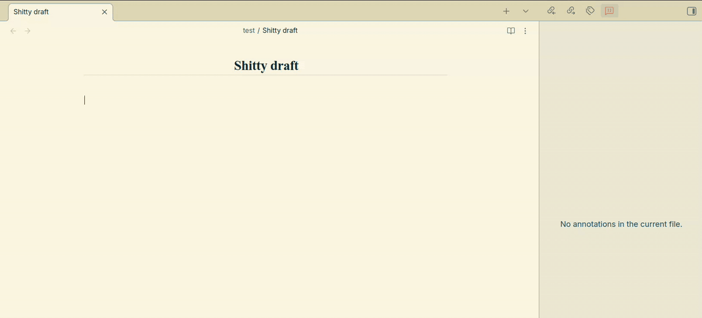
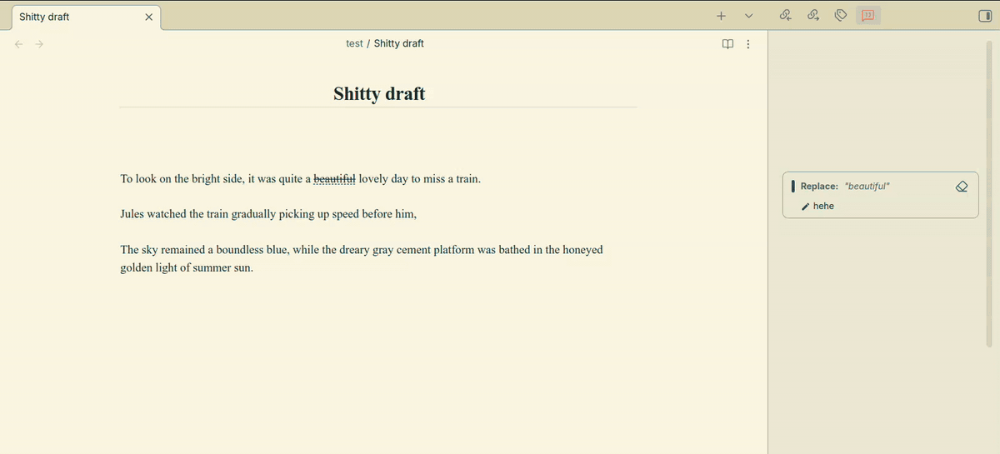
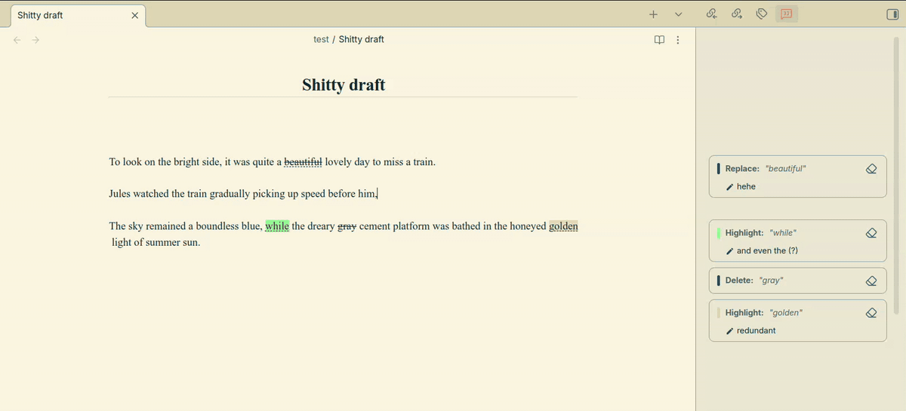

# Permanent Ink

In the age of digital perfection, we often lose the messy, authentic process of thinking and writing. Every backspace erases not just letters, but the story of how an idea came to be.

This plugin turns your Obsidian editor into a canvas where thoughts layer upon each other. When you hit Backspace or Delete, words get crossed out instead of vanishing, creating a visible record of your mind at work.

Picture this: you're writing and type "she walked nervously" but then change it to "she paced." With Permanent Ink, you get <code>she <del>walked nervously</del> paced</code>. So the evolution is preserved.

This plugin was built on top of ideas from [jancbeck/obsidian-note-annotations](https://github.com/jancbeck/obsidian-note-annotations). What started as a few personal modifications grew into something different enough.

---

## Features

### Restricted writing mode

The main purpose of the plugin. When active (shown as **Permanent ink is on** in your status bar), the editor enforces a write-forward discipline:

- **Backspace and Delete apply strikethroughs** instead of erasing. Selecting text and pressing either key wraps the selection in `~~strikethrough~~`.
- **New text always goes to the end.** Typing mid-document moves your cursor to the last line first. If you're inside a recognized delimiter pair at the document's end (like parentheses or brackets), the cursor jumps to just before the closing character instead.
- **Undo and Cut are blocked.** `Ctrl/Cmd+Z` and `Ctrl/Cmd+X` do nothing in restricted mode.
- **No mid-document line breaks.** Pressing Enter only works at the very end of the document.
- **Cursor navigation is annotation-aware.** Arrow keys skip over highlight and strikethrough blocks atomically, so you never land inside the `==` or `~~` markers. Note pins are skipped the same way.
- **Only the text is permanent.** The file name at the top of the note, the Properties block, and the search bar all work normally, so you can still rename a file or edit its properties while the mode is on.

Toggle the mode by clicking the status bar item, pressing `Ctrl/Cmd+Shift+E`, or running the **Toggle editing mode** command. The shortcut works even when the editor isn't focused, and you can change it under **Settings → Hotkeys**.

### Highlights

Select any text and press `H` (or use the **Highlight selection** command) to wrap it in `==highlight==`.

In the live preview editor, highlights render as colored spans. Clicking one opens a popover where you can:

- Pick a color from the palette
- Write a comment (stored as `==text==<!--your comment @colorname-->`)
- Copy the highlighted text to your clipboard
- Remove the highlight entirely

The color palette options are configurable in the plugin settings.

### Strikethroughs

Select text and press Backspace, Delete, or use the **Strikethrough selection** command to wrap it in `~~strikethrough~~`.

Like highlights, clicking a strikethrough in live preview opens the same popover, where you can attach a comment or remove it.

### Selection popup

Whenever you select text with your mouse or finger, a small floating toolbar appears near the selection with two options:

- **Cross out**: applies a strikethrough
- **Highlight**: applies a highlight

The popup is draggable. You can also use keyboard shortcuts (`H` for highlight, `Backspace`/`Delete` for strikethrough) while it's open.

### Annotations sidebar

Click the quote icon in the ribbon to open a sidebar panel listing every highlight, strikethrough, and note in the current document.

Cards sit right next to the text they belong to, like comments in Google Docs. Scroll the editor and the cards scroll along with it. Scroll the sidebar and the editor follows. When two annotations are close together, the cards stack instead of overlapping, so a busy paragraph pushes its cards a little further down.

Each card shows the annotated text, its type, and any attached comment. Clicking a card scrolls the editor to that annotation and briefly flashes a red outline around it. From the card you can:

- Edit the attached comment inline
- Remove the annotation (replacing it with plain text)

Note cards work a bit differently. They show the rendered note, and the pencil button opens it in a new tab. See [Notes](#notes) below.

The sidebar updates automatically as you edit. In reading view, the cards go back to a simple list.

### Notes

Sometimes a thought belongs in the middle of the text, but restricted mode won't let you insert anything there. Notes solve that. A note is pinned to a spot in your writing without changing the writing itself.

Right-click where you want the note and choose **Add note here**, or run the **Add note at cursor** command. A small pin appears in the text, and the note opens in a new tab so you can write it. Notes are regular markdown files, so they can be as long as you like and hold links, lists, embeds, or anything else.

Clicking a pin opens a popover with the rendered note. It's read-only, like reading view. You can select and copy the text, but not edit it there. From the popover you can:

- Open the note in a new tab to edit it
- Delete the note (removing both the pin and the file)

Each note also gets a card in the sidebar, next to its pin.

Notes live in a folder that belongs to the post. For a post called `A's journal`, that's `A's journal notes/`, with files named `Note 1`, `Note 2`, and so on. Each note carries a small `perink-note` property that ties it to its pin. Keep that property, but otherwise rename or move the note wherever you want, and the pin still finds it. If you rename or move the post, its notes folder moves along with it.

By default, notes can be edited freely even with restricted mode on. They're asides, not part of the writing. If you'd rather keep them permanent too, turn on **Keep notes permanent** in the settings.

### Quad indentation

A lightweight indentation system built for restricted mode. On the last line of the document, pressing `Tab` inserts a `$\quad$ ` block at the start of the line (rendered as indentation in the editor). Pressing Tab again adds another `\quad` to deepen it.

In restricted mode, Backspace and arrow keys are aware of these blocks and skip over them cleanly rather than landing the cursor inside the LaTeX syntax.

### Reading mode support

Highlights and strikethroughs with comments render correctly in Obsidian's reading view. The color is applied as a background, and hovering over an annotated word shows the comment as a tooltip.

Note pins only show in the editor (for now). In reading view they're hidden, and the notes themselves stay in their own files.

---

## Installation

1. Download the plugin files.
2. Place them in `.obsidian/plugins/permanent-ink/` inside your vault.
3. Enable the plugin under **Settings → Community Plugins**.
4. **Permanent ink is on** will appear in your status bar.

---

## Configuration

Open **Settings → Permanent Ink** to adjust:

**Expand selection**: when enabled, highlight and strikethrough commands automatically expand the selection to cover complete words. This prevents broken markdown rendering from partial-word selections. Hold `Alt` while selecting to override this on the fly.

**Keep notes permanent**: when enabled, restricted mode also applies inside note files. When disabled (the default), notes can be edited freely while your posts stay permanent.

**Highlighting color options**: a comma-separated list of [CSS color names](https://147colors.com) that appear in the color palette. Requires an app reload to take effect.

---

## How Restricted Mode handles keys

| Key | Behavior |
|---|---|
| Typing | Moves cursor to end of document, then types normally |
| `Backspace` / `Delete` | Applies strikethrough to selection or nearest word |
| `Tab` | Adds `$\quad$` indentation on the last line |
| `Enter` | Blocked unless cursor is at the very end of the document |
| `Ctrl/Cmd+Z` | Blocked |
| `Ctrl/Cmd+X` | Blocked |
| Arrow keys | Navigation, with smart skipping around annotation blocks, note pins, and quad indentation |
| `Ctrl/Cmd+Shift+E` | Turns restricted mode on or off |

---

## License

Permanent Ink is released under the [MIT license](LICENSE). It builds on
`obsidian-note-annotations` by Jan Beck, whose own MIT notice is kept in
[NOTICE.md](NOTICE.md).
